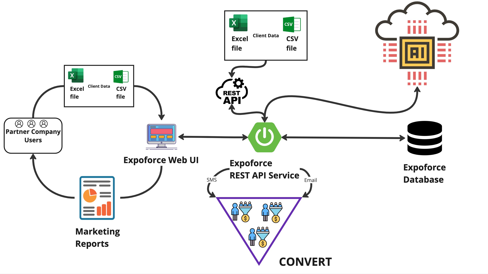

# ExpoForce -система релевантных предложений продуктов для клиентов

# Презентацию решения смотреть [тут]()

## Верхнеуровневая архитектура:


### Команда разработки:
- Рустам Курамшин - @KuramshinRustam
- Александр Янчий - @AlexYanchiy
- Рустам Зулкарниев - @WerderR
- Владислав Калинин - @First_Kalinin
- Рустам Гулямов - @gulyamovrustam
- Роман Горбатенко - @Elanlum

### Запуск проекта

- Клонируйте репозиторий с GitHub

- Скачайте и установите JDK 17 для своей ОС на сайте Eclipse [по этой ссылке](https://adoptium.net/temurin/releases/)

- Выполните команду сборки:

```shell
# linux or mac os
./gradlew -Pvaadin.productionMode=true bootJar

# windows 
gradlew.bat -Pvaadin.productionMode=true bootJar
```

- Установите Docker Desktop с [официального сайта](https://www.docker.com/products/docker-desktop/)

- Запустите все контейнеры docker-compose следующей командой:
```shell
docker-compose up -d
```

- Чтобы войти в систему "ExpoForce" перейдите по ссылке [http://localhost:8081](http://localhost:8081). Логин: "admin", пароль: "admin".